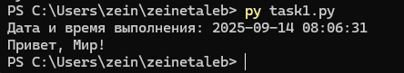

# Тема 1. Работа с репозиториями
**ФИО:** Зейн Талеб Шейхна  
**Группа:** ИВТ-23-1

## Итоговая таблица
| Задание | Лаб_раб | Сам_раб |
|---|---|---|
| Задание 1 | + | - |
| Задание 2 | - | - |
| Задание 3 | - | - |
| Задание 4 | - | - |
| Задание 5 | - | - |
| Задание 6 | - | - |
| Задание 7 | - | - |
| Задание 8 | - | - |
| Задание 9 | - | - |
| Задание 10 | - | - |

---

## Задание 1
**Код:** 	task1.py

**Скрин:** 

**Вывод:** Программа успешно вывела в консоль текущую дату и время, а также заданный текст. Это подтверждает, что Python установлен и работает корректно.
